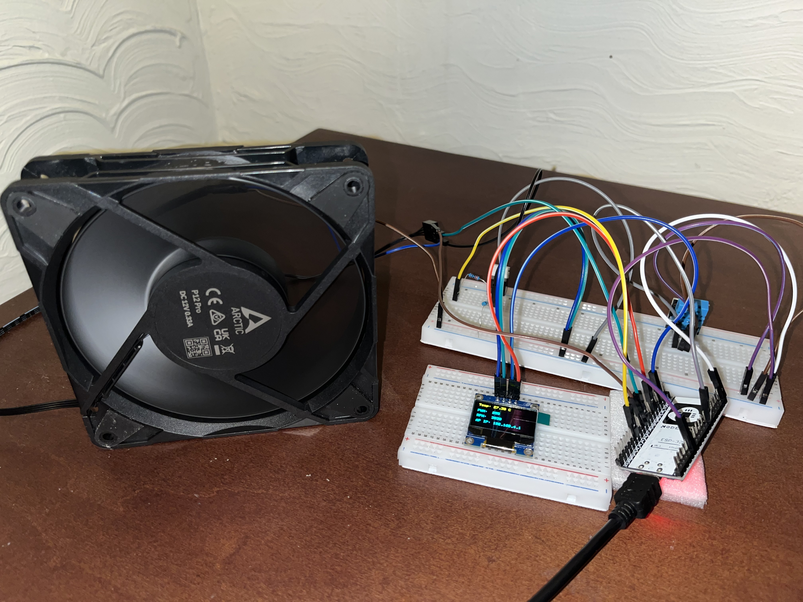
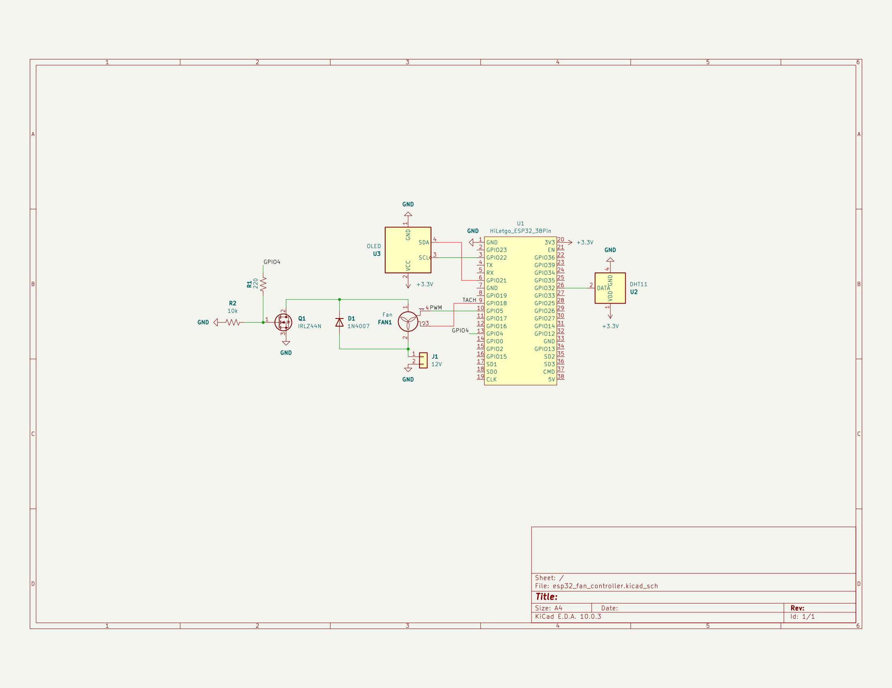
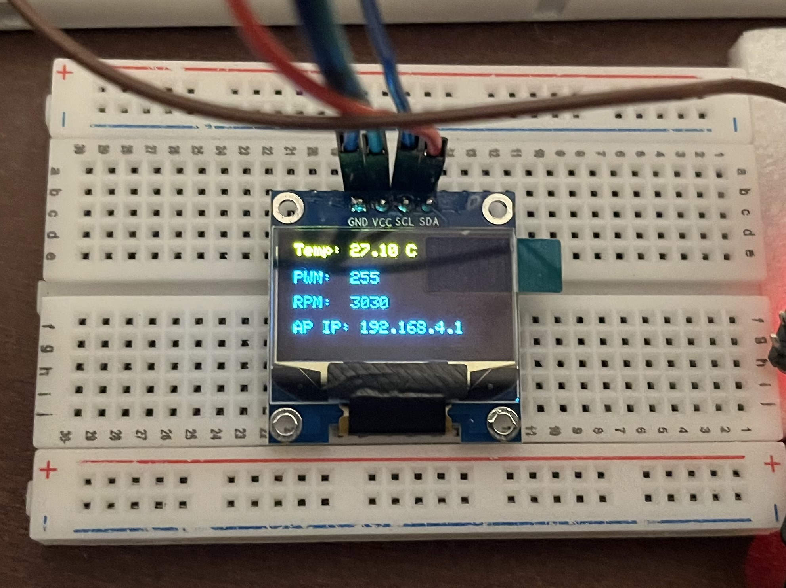
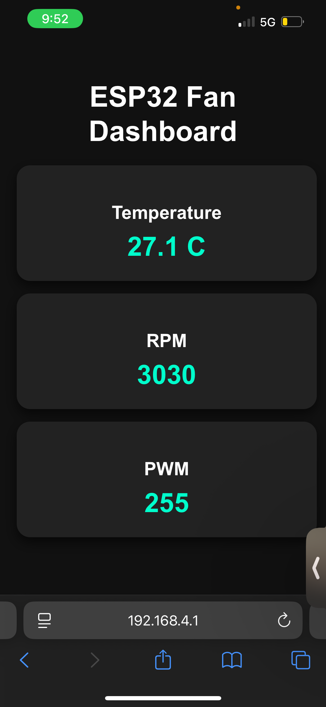

# IoT-Fan-Controller
ESP32-based fan control system with RPM monitoring, DHT11 sensor, OLED display, and Wi-Fi dashboard.
## Overview
This project is an IoT system built on ESP32 that controls fan speed based on temperature readings. 
## Features
- Automatic Temperature-controlled fan
- Real-time RPM measurements using interrupt
- OLED display
- Wi-Fi web dashboard with live updates

## Hardware
- ESP32
- DC Fan
- MOSFET IRLZ44N
- SSD1306 OLED Display
- DHT11 Sensor

## Images

### System Setup

### Circuit Schematic

### OLED Display Output

### Web Dashboard

